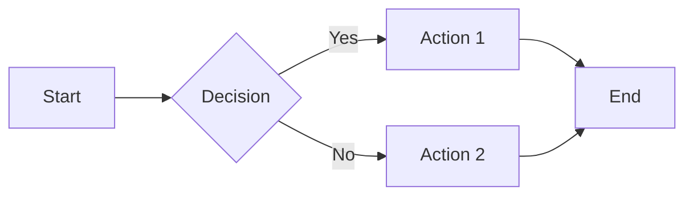

## <i class="fas fa-markdown"></i> Markdown Features Guide

{: .note }
**📝 Documentation Enhancement**: This guide shows all the advanced markdown features available throughout this documentation site.

### <i class="fas fa-exclamation-circle"></i> Enhanced Callouts

Use these special callout blocks to highlight important information:

{: .highlight }
> **🎯 Highlight**: For important information that should stand out prominently.

{: .important }
> **⚠️ Important**: Critical information users must pay attention to for proper implementation.

{: .note }
> **📝 Note**: Additional context, tips, or clarifications that enhance understanding.

{: .warning }
> **⚠️ Warning**: Potential issues or pitfalls that users should be aware of and avoid.

{: .new }
> **✨ New Feature**: Recently added functionality or improvements in the latest version.

**Syntax:**
```markdown
{: .highlight }
> **🎯 Highlight**: Your highlighted content here.

{: .important }
> **⚠️ Important**: Your important information here.
```

### <i class="fas fa-code"></i> Advanced Code Blocks

Enhanced syntax highlighting with multiple language support:

**Python with type hints:**
```python
from typing import Dict, List, Optional
import torch

def process_agents(agents: List[Agent], config: Dict[str, Any]) -> Optional[Results]:
    """Process a list of agents with given configuration."""
    return None
```

**JSON configuration:**
```json
{
  "scenario": {
    "type": "competitive_tournament",
    "participants": 8,
    "duration": "1h"
  }
}
```

**YAML configuration:**
```yaml
# Multi-agent configuration
agents:
  - name: "agent_1"
    type: "competitive"
    skill_level: 0.8
```

### <i class="fas fa-table"></i> Rich Tables

Create informative tables with emojis and styling:

| Feature | Complexity | Status | Priority |
|---------|------------|--------|----------|
| **Tournament Mode** | ⭐⭐⭐ | ✅ Complete | 🔥 High |
| **Knowledge Transfer** | ⭐⭐⭐⭐ | 🚧 In Progress | 🔥 High |
| **Visualization** | ⭐⭐ | ✅ Complete | 🔶 Medium |

### <i class="fas fa-list-check"></i> Interactive Task Lists

Create hierarchical task lists with checkboxes:

- **🎯 Core Features**
  - [x] Basic tournament implementation
  - [x] Agent management system
  - [ ] Advanced analytics
    - [x] Performance metrics
    - [x] Learning curves
    - [ ] Real-time dashboards
  - [ ] Mobile optimization

### <i class="fas fa-keyboard"></i> Keyboard Shortcuts

Document keyboard shortcuts with special formatting:

| Action | Shortcut | Description |
|--------|----------|-------------|
| Search documentation | <kbd>Ctrl</kbd> + <kbd>K</kbd> | Open search dialog |
| Navigate to section | <kbd>Ctrl</kbd> + <kbd>G</kbd> | Jump to specific section |
| Print current page | <kbd>Ctrl</kbd> + <kbd>P</kbd> | Print documentation |

### <i class="fas fa-calculator"></i> Mathematical Expressions

Include mathematical formulas using LaTeX syntax:

The knowledge transfer efficiency is calculated as:

$$\eta_{transfer} = \frac{\sum_{i=1}^{n} w_i \cdot sim(K_{teacher}, K_{student}^{(i)})}{n \cdot complexity_{factor}}$$

Where $\eta_{transfer}$ represents the transfer efficiency score.

### <i class="fas fa-palette"></i> Visual Elements

**Feature Cards:**
```html
<div class="feature-grid">
  <div class="feature-card">
    <div class="feature-icon">🚀</div>
    <h4>Feature Title</h4>
    <p>Feature description goes here</p>
  </div>
</div>
```

**Content Sections:**
```html
<div class="content-section">
  Your enhanced content with background styling
</div>
```

**Badges:**
```html
<span class="badge" style="background: #10b981; color: white; padding: 0.5rem 1rem; border-radius: 0.5rem;">
  <i class="fas fa-star"></i> Featured
</span>
```

### <i class="fas fa-quote-left"></i> Enhanced Quotes

Create visually appealing blockquotes:

> **💡 Research Insight**
>
> "*Multi-agent collaborative learning represents a paradigm shift from traditional single-agent optimization to cooperative intelligence systems.*"
>
> — *Dr. AI Researcher*

### <i class="fas fa-link"></i> Interactive Elements

**Styled Buttons:**
```html
<div style="text-align: center; margin: 2rem 0;">
  <a href="#" class="btn btn-primary">
    <i class="fas fa-download"></i> Download
  </a>
  <a href="#" class="btn">
    <i class="fab fa-github"></i> View Source
  </a>
</div>
```

### <i class="fas fa-chart-line"></i> Mermaid Diagrams

Create interactive diagrams with Mermaid:



### <i class="fas fa-palette"></i> Custom Styling Classes

**Available CSS Classes:**
- `.content-section` - Enhanced content blocks
- `.feature-grid` - Responsive card layouts
- `.feature-card` - Individual feature cards
- `.badge` - Inline status badges
- `.btn` / `.btn-primary` - Styled buttons

### <i class="fas fa-lightbulb"></i> Best Practices

1. **🎨 Consistent Styling**: Use the same patterns across pages
2. **📱 Mobile-First**: Test on different screen sizes
3. **♿ Accessibility**: Include alt text and proper contrast
4. **🔗 Navigation**: Use clear headings and links
5. **📊 Visual Hierarchy**: Employ icons and colors meaningfully

{: .important }
> **🚀 Pro Tip**: Combine multiple markdown features to create rich, engaging documentation that helps users understand complex concepts quickly and effectively.