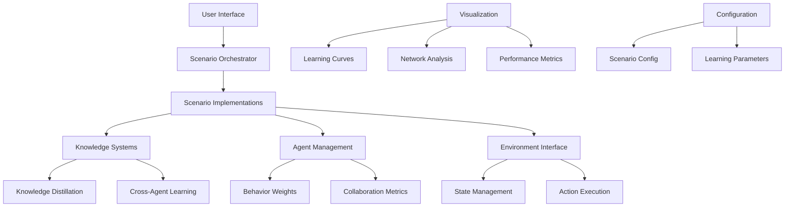

# Architecture Guide
{: .no_toc }

Comprehensive architectural overview of the Multi-Agent Collaborative Learning library.

## Table of Contents
{: .no_toc .text-delta }

1. TOC
{:toc}

---

## System Overview

The Multi-Agent Collaborative Learning library is designed as a modular, extensible framework that enables complex multi-agent learning scenarios. The architecture follows clean separation of concerns with well-defined interfaces between components.

### High-Level Architecture



## Core Components

### 1. Configuration System (`core.config`)

The configuration system provides type-safe, validated configuration for all scenarios and learning parameters.

#### Key Classes:
- **`ScenarioConfig`**: Central configuration for all learning scenarios
- **`LearningScenarioType`**: Enumeration of available scenario types
- **`LearningOutcome`**: Structured representation of learning results

#### Design Principles:
- **Validation**: All configuration parameters are validated at initialization
- **Type Safety**: Full type annotations with runtime checking
- **Extensibility**: Easy to add new scenario types and parameters

```python
@dataclass
class ScenarioConfig:
    scenario_type: LearningScenarioType
    duration_episodes: int = 100
    participants: int = 6
    success_criteria: Dict[str, float] = field(default_factory=dict)

    def __post_init__(self):
        # Comprehensive validation
        if self.duration_episodes <= 0:
            raise ValueError("duration_episodes must be positive")
```

### 2. Knowledge Systems (`core.knowledge`)

Neural knowledge distillation and transfer mechanisms enable sophisticated learning between agents.

#### Architecture:
- **Compression Networks**: Reduce knowledge dimensionality for efficient transfer
- **Decompression Networks**: Reconstruct knowledge for target agents
- **Quality Assessment**: Evaluate transfer effectiveness
- **Cross-Agent Alignment**: Harmonize knowledge representations

```python
class KnowledgeDistillationEngine(nn.Module):
    def __init__(self, feature_dim: int = 512):
        super().__init__()
        self.knowledge_compressor = self._build_compressor()
        self.knowledge_decompressor = self._build_decompressor()
        self.quality_assessor = self._build_assessor()
        self.alignment_network = nn.MultiheadAttention(...)
```

### 3. Scenario Framework (`scenarios/`)

Modular scenario implementations with a common base interface.

#### Base Architecture:
```python
class BaseScenario(ABC):
    def __init__(self, agents: List[Any], config: ScenarioConfig):
        self.agents = agents
        self.config = config
        self.results = {}

    @abstractmethod
    def run(self, environment: Any) -> Dict[str, Any]:
        pass

    def validate_agents(self) -> bool:
        # Common validation logic
        pass
```

#### Scenario Implementations:

##### Competitive Learning Tournament
- **Tournament Structure**: Bracket and round-robin formats
- **Performance Tracking**: ELO-style ranking system
- **Behavior Analysis**: Competitive strategy detection
- **Adaptation**: Post-match learning updates

##### Mentor-Student Networks
- **Relationship Graph**: NetworkX-based mentorship tracking
- **Knowledge Transfer**: Neural distillation between agents
- **Teaching Assessment**: Effectiveness measurement and adaptation
- **Learning Progress**: Individual student progression tracking

##### Collaborative Research Environment
- **Team Formation**: Skill-based agent assignment
- **Discovery System**: Breakthrough and innovation detection
- **Knowledge Sharing**: Cross-team collaboration mechanisms
- **Research Metrics**: Innovation and productivity measurement

### 4. Orchestration System (`scenarios.orchestrator`)

Manages multiple scenarios and cross-scenario learning.

#### Key Features:
- **Scenario Registration**: Dynamic scenario management
- **Sequential Execution**: Ordered scenario running with state persistence
- **Cross-Learning Analysis**: Transfer between scenarios
- **Agent Development**: Long-term capability tracking

#### Architecture Pattern:
```python
class ScenarioOrchestrator:
    def __init__(self, agents: List[Any]):
        self.agents = agents
        self.scenarios = {}  # Registered scenarios
        self.scenario_results = {}  # Historical results

    def run_scenario_suite(self, environment, sequence):
        for scenario_name in sequence:
            # Run scenario
            results = self._run_single_scenario(scenario_name, environment)

            # Analyze cross-scenario learning
            cross_learning = self._analyze_cross_scenario_learning(...)

            # Update agent parameters
            self._inter_scenario_adaptation(...)
```

## Data Flow Architecture

### Learning Episode Flow


### Knowledge Transfer Flow


## Performance Considerations

### Scalability Design

#### Agent Scaling:
- **O(n²)** complexity for full interaction scenarios
- **O(n log n)** for tournament brackets
- **O(n)** for mentor-student chains

#### Memory Management:
- Lazy loading of scenario states
- Configurable history retention
- Efficient knowledge representation compression

#### Computational Optimization:
- Parallel scenario execution support
- GPU acceleration for knowledge distillation
- Batched agent updates

### Configuration Patterns

#### Environment Abstraction:
The library uses a minimal environment interface to support various backends:

```python
class EnvironmentInterface:
    def reset(self) -> State
    def step(self, agent_id: str, action: Action) -> Tuple[State, Reward, Done]
    def get_state(self) -> State
```

#### Agent Abstraction:
Flexible agent interface supporting diverse implementations:

```python
class AgentInterface:
    def select_action(self, state: State) -> Action
    def update(self, experience: Experience) -> None
    def get_metrics(self) -> Dict[str, float]
```

## Extension Points

### Adding Custom Scenarios

1. **Inherit from BaseScenario**:
```python
class CustomScenario(BaseScenario):
    def run(self, environment) -> Dict[str, Any]:
        # Implement custom logic
        pass
```

2. **Register with Orchestrator**:
```python
orchestrator.register_scenario('custom', CustomScenario(agents, config))
```

### Custom Knowledge Systems

1. **Extend KnowledgeDistillationEngine**:
```python
class CustomKnowledgeEngine(KnowledgeDistillationEngine):
    def custom_transfer_method(self, source, target):
        # Implement custom knowledge transfer
        pass
```

### Custom Metrics and Visualization

1. **Add to Visualization Utils**:
```python
def plot_custom_metric(data, **kwargs):
    # Custom visualization logic
    pass
```

## Quality Assurance

### Testing Architecture
- **Unit Tests**: Individual component testing
- **Integration Tests**: Cross-component interaction testing
- **Scenario Tests**: End-to-end scenario validation
- **Performance Tests**: Scalability and memory usage testing

### Logging and Monitoring
- **Hierarchical Logging**: Module-specific log levels
- **Performance Metrics**: Execution time tracking
- **Memory Monitoring**: Resource usage tracking
- **Error Recovery**: Graceful failure handling

This architecture provides a robust, scalable foundation for multi-agent collaborative learning research while maintaining flexibility for extension and customization.