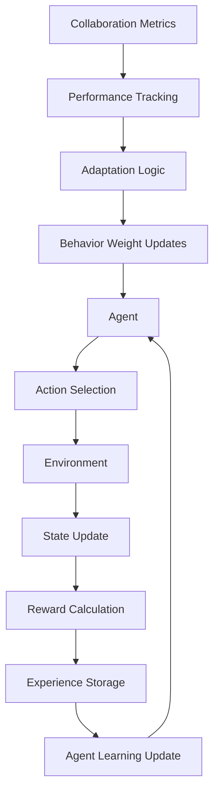
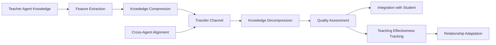
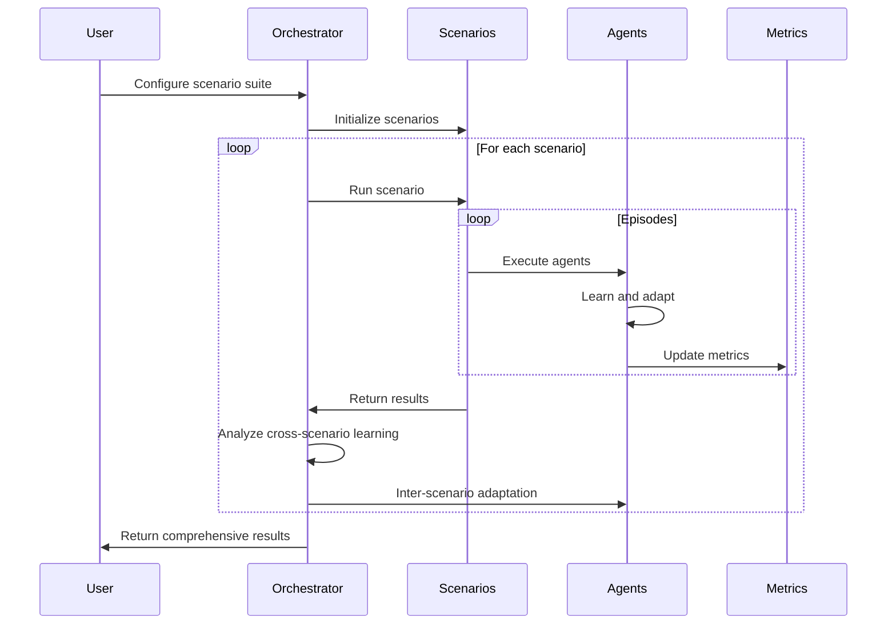
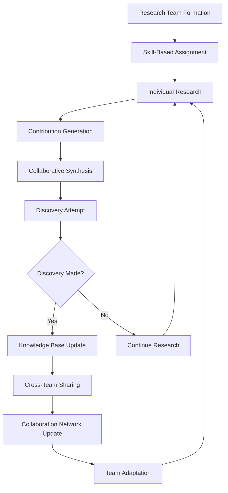
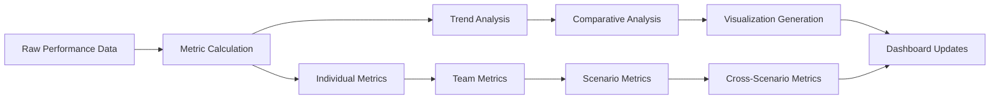

# Data Flow Guide
{: .no_toc }

Understanding the data flow patterns in multi-agent collaborative learning scenarios.

## Table of Contents
{: .no_toc .text-delta }

1. TOC
{:toc}

---

## Overview

The Multi-Agent Collaborative Learning library implements sophisticated data flow patterns that enable complex interactions between agents, knowledge systems, and learning environments. This guide explains the key data flow patterns and their implementations.

## Core Data Flow Patterns

### 1. Agent-Environment Interaction Flow



#### Implementation Details:

**Action Selection Process:**
```python
def select_action(self, state: torch.Tensor) -> Dict[str, Any]:
    # Neural network forward pass
    action_logits = self.policy_network(state)

    # Apply exploration strategy
    if self.exploration_mode:
        action = self._explore_action(action_logits)
    else:
        action = torch.argmax(action_logits)

    # Calculate uncertainty metrics
    uncertainty = self._calculate_uncertainty(action_logits)

    return {
        'action': action,
        'confidence': torch.max(action_logits).item(),
        'uncertainty': uncertainty
    }
```

**Experience Processing:**
```python
def process_experience(self, experience: Dict[str, Any]) -> None:
    # Update collaboration metrics
    self.collaboration_metrics['navigation_success'] = (
        self.collaboration_metrics.get('navigation_success', 0) * 0.9 +
        float(experience['success']) * 0.1
    )

    # Store in replay buffer
    self.replay_buffer.add(experience)

    # Update policy if enough experiences
    if len(self.replay_buffer) > self.min_replay_size:
        self._update_policy()
```

### 2. Knowledge Transfer Flow

The knowledge distillation system implements a sophisticated transfer pipeline:



#### Knowledge Representation:

**Teacher Knowledge Extraction:**
```python
def extract_knowledge(self, agent: CollaborativeAgent) -> torch.Tensor:
    """Extract high-level knowledge representation from agent."""

    # Get activations from key network layers
    with torch.no_grad():
        # Policy network features
        policy_features = agent.policy_network.feature_extractor(sample_states)

        # Value network features
        value_features = agent.value_network.feature_extractor(sample_states)

        # Combine and normalize
        combined_features = torch.cat([policy_features, value_features], dim=1)
        knowledge_repr = F.normalize(combined_features, p=2, dim=1)

    return knowledge_repr
```

**Knowledge Compression:**
```python
def compress_knowledge(self, teacher_knowledge: torch.Tensor) -> torch.Tensor:
    """Compress teacher knowledge for efficient transfer."""

    # Multi-layer compression with residual connections
    x = teacher_knowledge
    compressed_layers = []

    for layer in self.compression_layers:
        residual = x
        x = layer(x)
        if x.shape == residual.shape:
            x = x + residual  # Residual connection
        compressed_layers.append(x)

    # Attention-weighted combination of compressed layers
    attention_weights = self.attention_layer(torch.stack(compressed_layers, dim=1))
    compressed = torch.sum(torch.stack(compressed_layers, dim=1) * attention_weights, dim=1)

    return compressed
```

### 3. Scenario Orchestration Flow

The orchestrator manages complex multi-scenario learning workflows:



#### Cross-Scenario Learning Analysis:

**Skill Transfer Calculation:**
```python
def calculate_skill_transfer(self, agent_id: str, prev_scenarios: List[str], current: str) -> float:
    """Calculate skill transfer effectiveness between scenarios."""

    base_transfer = 0.3
    scenario_similarity = self._calculate_scenario_similarity(prev_scenarios, current)

    # Weight recent scenarios more heavily
    weighted_similarity = sum(
        similarity * (0.9 ** i)
        for i, similarity in enumerate(scenario_similarity)
    )

    # Agent-specific learning rate modifier
    agent_learning_rate = self.agents[agent_id].behavior_weights.get('learning_rate', 0.1)
    transfer_efficiency = base_transfer + weighted_similarity * agent_learning_rate

    return min(1.0, transfer_efficiency)
```

**Adaptation Speed Measurement:**
```python
def measure_adaptation_speed(self, agent_id: str, scenario_results: Dict[str, Any]) -> float:
    """Measure how quickly agent adapts to new scenario."""

    # Extract performance trajectory
    performance_trajectory = self._extract_performance_trajectory(agent_id, scenario_results)

    if len(performance_trajectory) < 3:
        return 0.5  # Default if insufficient data

    # Calculate improvement rate using linear regression
    x = np.arange(len(performance_trajectory))
    y = np.array(performance_trajectory)

    # Fit linear trend
    slope, intercept = np.polyfit(x, y, 1)

    # Normalize slope to [0, 1] range
    adaptation_speed = min(1.0, max(0.0, (slope + 0.1) / 0.2))

    return adaptation_speed
```

### 4. Competitive Tournament Flow

Tournament scenarios implement complex multi-agent competition dynamics:

```mermaid
graph TB
    A[Tournament Initialization] --> B[Bracket Generation]
    B --> C[Match Execution]

    C --> D[Agent vs Agent]
    D --> E[Competitive Behavior Detection]
    E --> F[Performance Evaluation]
    F --> G[ELO Rating Update]

    G --> H[Next Match]
    H --> C

    C --> I[Tournament Complete]
    I --> J[Final Rankings]
    J --> K[Learning Outcome Analysis]
```



#### Competitive Behavior Detection:

**Aggressive Strategy Detection:**
```python
def detect_competitive_behavior(self, agent: CollaborativeAgent,
                               action_result: Dict[str, Any]) -> Optional[Dict[str, Any]]:
    """Detect and classify competitive behaviors."""

    confidence = action_result.get('confidence', 0.5)
    uncertainty = action_result.get('uncertainty', 0.5)

    behaviors = []

    # High confidence actions suggest aggressive strategy
    if confidence > 0.8:
        behaviors.append({
            'type': 'aggressive_strategy',
            'intensity': confidence,
            'description': 'High-confidence action selection'
        })

    # High uncertainty might indicate defensive behavior
    if uncertainty > 0.7:
        behaviors.append({
            'type': 'defensive_strategy',
            'intensity': uncertainty,
            'description': 'Cautious action selection under uncertainty'
        })

    # Rapid action changes suggest adaptive strategy
    if hasattr(agent, 'action_history') and len(agent.action_history) >= 3:
        recent_actions = agent.action_history[-3:]
        if len(set(recent_actions)) == 3:  # All different
            behaviors.append({
                'type': 'adaptive_strategy',
                'intensity': 0.8,
                'description': 'Rapid strategy adaptation'
            })

    return behaviors if behaviors else None
```

### 5. Research Collaboration Flow

Research scenarios implement sophisticated discovery and knowledge sharing mechanisms:



#### Discovery Detection Algorithm:

**Discovery Scoring:**
```python
def attempt_discovery(self, research_result: Dict[str, Any], topic: Dict[str, Any]) -> Dict[str, Any]:
    """Determine if research results constitute a discovery."""

    progress = research_result['progress']
    quality = research_result['quality']
    innovation = research_result['innovation']

    # Weighted scoring based on topic complexity
    complexity_factor = topic['complexity']
    discovery_threshold = complexity_factor * 0.8

    # Multi-factor discovery score
    discovery_score = (
        progress * 0.4 +      # Research progress weight
        quality * 0.3 +       # Quality of work
        innovation * 0.3      # Innovation factor
    )

    # Bonus for collaborative synergy
    if research_result.get('synergy_achieved', False):
        discovery_score *= 1.2

    discovered = discovery_score > discovery_threshold

    result = {
        'attempted': True,
        'discovered': discovered,
        'discovery_score': discovery_score,
        'threshold': discovery_threshold
    }

    if discovered:
        # Classify discovery type based on contributing factors
        if innovation > 2.0:
            discovery_type = 'breakthrough'
        elif quality > 0.8:
            discovery_type = 'fundamental_insight'
        elif progress > 0.7:
            discovery_type = 'incremental_advance'
        else:
            discovery_type = 'methodological_improvement'

        result.update({
            'discovery_type': discovery_type,
            'significance': discovery_score - discovery_threshold,
            'reproducibility': quality,
            'novelty': min(1.0, innovation / 3.0)
        })

    return result
```

### 6. Performance Metrics Flow

Comprehensive performance tracking across all scenarios:



#### Metric Aggregation Pipeline:

**Performance Trend Analysis:**
```python
def analyze_performance_trends(self, agent_metrics: List[Dict[str, float]]) -> Dict[str, Any]:
    """Analyze performance trends over time."""

    if len(agent_metrics) < 3:
        return {'trend': 'insufficient_data'}

    # Extract time series data
    timestamps = [m['timestamp'] for m in agent_metrics]
    performance_values = [m['performance'] for m in agent_metrics]

    # Calculate moving averages
    window_size = min(5, len(performance_values) // 2)
    moving_avg = np.convolve(performance_values, np.ones(window_size)/window_size, mode='valid')

    # Trend detection using regression
    x = np.arange(len(moving_avg))
    slope, intercept, r_value = stats.linregress(x, moving_avg)[:3]

    # Classify trend
    if abs(slope) < 0.01:
        trend_type = 'stable'
    elif slope > 0.01:
        trend_type = 'improving'
    else:
        trend_type = 'declining'

    # Volatility calculation
    volatility = np.std(performance_values) / np.mean(performance_values)

    return {
        'trend': trend_type,
        'slope': slope,
        'correlation': r_value ** 2,
        'volatility': volatility,
        'latest_performance': performance_values[-1],
        'average_performance': np.mean(performance_values)
    }
```

## Data Persistence and State Management

### State Persistence Strategy:

**Scenario State Management:**
```python
class ScenarioStateManager:
    """Manages persistent state across scenario executions."""

    def __init__(self, base_path: str):
        self.base_path = Path(base_path)
        self.state_cache = {}

    def save_scenario_state(self, scenario_name: str, state: Dict[str, Any]) -> None:
        """Save scenario state to persistent storage."""

        state_file = self.base_path / f"{scenario_name}_state.json"

        # Serialize complex objects
        serialized_state = self._serialize_state(state)

        with open(state_file, 'w') as f:
            json.dump(serialized_state, f, indent=2, default=str)

        # Update cache
        self.state_cache[scenario_name] = serialized_state

    def load_scenario_state(self, scenario_name: str) -> Dict[str, Any]:
        """Load scenario state from persistent storage."""

        # Check cache first
        if scenario_name in self.state_cache:
            return self.state_cache[scenario_name]

        state_file = self.base_path / f"{scenario_name}_state.json"

        if state_file.exists():
            with open(state_file, 'r') as f:
                serialized_state = json.load(f)

            # Deserialize complex objects
            state = self._deserialize_state(serialized_state)
            self.state_cache[scenario_name] = state
            return state

        return {}
```

This comprehensive data flow architecture ensures efficient, scalable, and maintainable multi-agent collaborative learning while providing rich insights into agent behavior and learning dynamics.