# <i class="fas fa-project-diagram"></i> Data Flow Guide
{: .no_toc }

<div class="content-section" style="background: linear-gradient(135deg, #f0f9ff, #e0f2fe); text-align: center;">
  <h2 style="margin-top: 0; color: #1e293b;"><i class="fas fa-flow-chart"></i> Interactive Data Flow Visualizations</h2>
  <p style="color: #475569;">Comprehensive visual guide to multi-agent collaborative learning data flows with interactive Mermaid diagrams</p>
</div>

{: .important }
> **💡 Interactive Diagrams**: All diagrams below are interactive! Click nodes to highlight paths, and use your browser's zoom to explore details.

Understanding the data flow patterns in multi-agent collaborative learning scenarios through comprehensive visual representations.

## Table of Contents
{: .no_toc .text-delta }

1. TOC
{:toc}

---

## <i class="fas fa-sitemap"></i> System Architecture Overview

The Multi-Agent Collaborative Learning library implements sophisticated data flow patterns that enable complex interactions between agents, knowledge systems, and learning environments. This comprehensive diagram shows how all components interact:

```mermaid
graph TB
    subgraph "🎯 User Interface Layer"
        UI[👤 User Interface]
        CONFIG[⚙️ Configuration Manager]
        DASH[📊 Dashboard]
    end

    subgraph "🧠 Orchestration Layer"
        ORCH[🎭 Scenario Orchestrator]
        SCHED[📅 Task Scheduler]
        COORD[🤝 Agent Coordinator]
    end

    subgraph "🤖 Agent Management"
        direction TB
        AGENTS[🤖 Agent Pool]
        KNOWLEDGE[🧠 Knowledge Base]
        NETWORK[🌐 Collaboration Network]

        subgraph "Agent Types"
            COMP[🏆 Competitive Agents]
            MENTOR[👨‍🏫 Mentor Agents]
            STUDENT[🎓 Student Agents]
            RESEARCH[🔬 Research Agents]
        end
    end

    subgraph "🏃‍♂️ Execution Environment"
        direction LR
        ENV1[🌍 Tournament Environment]
        ENV2[📚 Learning Environment]
        ENV3[🔬 Research Environment]
        ENV4[⚖️ Evaluation Environment]
    end

    subgraph "📊 Analytics & Monitoring"
        METRICS[📈 Performance Metrics]
        VIZ[📊 Visualization Engine]
        ANALYTICS[🔍 Behavior Analytics]
        REPORTS[📋 Report Generator]
    end

    subgraph "💾 Data Layer"
        STATE[💾 State Management]
        PERSIST[🗄️ Persistence Layer]
        CACHE[⚡ Cache System]
        BACKUP[🔄 Backup System]
    end

    %% Main flow connections
    UI --> CONFIG
    CONFIG --> ORCH
    ORCH --> SCHED
    SCHED --> COORD
    COORD --> AGENTS

    %% Agent interactions
    AGENTS --> KNOWLEDGE
    KNOWLEDGE --> NETWORK
    AGENTS --> COMP
    AGENTS --> MENTOR
    AGENTS --> STUDENT
    AGENTS --> RESEARCH

    %% Environment connections
    COORD --> ENV1
    COORD --> ENV2
    COORD --> ENV3
    COORD --> ENV4

    %% Analytics flow
    ENV1 --> METRICS
    ENV2 --> METRICS
    ENV3 --> METRICS
    ENV4 --> METRICS
    METRICS --> VIZ
    METRICS --> ANALYTICS
    ANALYTICS --> REPORTS

    %% Data persistence
    ORCH --> STATE
    AGENTS --> STATE
    METRICS --> STATE
    STATE --> PERSIST
    STATE --> CACHE
    PERSIST --> BACKUP

    %% Feedback loops
    REPORTS --> DASH
    DASH --> UI
    ANALYTICS --> COORD
    VIZ --> DASH

    %% Styling
    classDef uiLayer fill:#e3f2fd,stroke:#1976d2,stroke-width:3px,color:#000
    classDef orchestrationLayer fill:#f3e5f5,stroke:#7b1fa2,stroke-width:3px,color:#000
    classDef agentLayer fill:#e8f5e8,stroke:#388e3c,stroke-width:3px,color:#000
    classDef envLayer fill:#fff3e0,stroke:#f57c00,stroke-width:3px,color:#000
    classDef analyticsLayer fill:#fce4ec,stroke:#c2185b,stroke-width:3px,color:#000
    classDef dataLayer fill:#f1f8e9,stroke:#689f38,stroke-width:3px,color:#000

    class UI,CONFIG,DASH uiLayer
    class ORCH,SCHED,COORD orchestrationLayer
    class AGENTS,KNOWLEDGE,NETWORK,COMP,MENTOR,STUDENT,RESEARCH agentLayer
    class ENV1,ENV2,ENV3,ENV4 envLayer
    class METRICS,VIZ,ANALYTICS,REPORTS analyticsLayer
    class STATE,PERSIST,CACHE,BACKUP dataLayer
```



{: .note }
**🎨 Color Legend**:
- **Blue**: User interface and configuration systems
- **Purple**: Orchestration and coordination logic
- **Green**: Agent management and AI systems
- **Orange**: Execution environments and scenarios
- **Pink**: Analytics and monitoring systems
- **Light Green**: Data persistence and storage

This guide explains the key data flow patterns and their implementations.

## Core Data Flow Patterns

### 1. <i class="fas fa-robot"></i> Agent-Environment Interaction Flow

{: .highlight }
> **Core Learning Loop**: This diagram shows the fundamental learning cycle where agents interact with environments and continuously improve through experience.

```mermaid
flowchart TB
    subgraph "Agent Decision System"
        A[🤖 Agent] --> B[🧠 Action Selection]
        B --> B1[Policy Network]
        B --> B2[Exploration Strategy]
        B1 --> B3[Action Output]
        B2 --> B3
    end

    subgraph "Environment Interaction"
        B3 --> C[🌍 Environment]
        C --> D[📊 State Update]
        D --> E[🎯 Reward Calculation]
        E --> E1[Immediate Reward]
        E --> E2[Long-term Value]
    end

    subgraph "Learning Pipeline"
        E1 --> F[💾 Experience Storage]
        E2 --> F
        F --> G[🔄 Agent Learning Update]
        G --> G1[Policy Gradient]
        G --> G2[Value Function Update]
        G1 --> A
        G2 --> A
    end

    subgraph "Collaboration Monitoring"
        H[📈 Collaboration Metrics] --> I[📋 Performance Tracking]
        I --> J[⚙️ Adaptation Logic]
        J --> K[⚖️ Behavior Weight Updates]
        K --> A
    end

    subgraph "Feedback Loops"
        D --> L[🔍 State Analysis]
        L --> M[🎲 Uncertainty Estimation]
        M --> B
        K --> N[🎛️ Hyperparameter Tuning]
        N --> G
    end

    classDef agentNode fill:#e1f5fe,stroke:#01579b,stroke-width:2px,color:#000
    classDef envNode fill:#f3e5f5,stroke:#4a148c,stroke-width:2px,color:#000
    classDef learningNode fill:#e8f5e8,stroke:#1b5e20,stroke-width:2px,color:#000
    classDef metricNode fill:#fff3e0,stroke:#e65100,stroke-width:2px,color:#000

    class A,B,B1,B2,B3 agentNode
    class C,D,E,E1,E2 envNode
    class F,G,G1,G2 learningNode
    class H,I,J,K,L,M,N metricNode
```



{: .note }
**🔍 Diagram Details**:
- **Blue nodes**: Agent decision-making components
- **Purple nodes**: Environment interaction elements
- **Green nodes**: Learning and adaptation systems
- **Orange nodes**: Performance monitoring and metrics

#### Implementation Details:

**Action Selection Process:**
```python
def select_action(self, state: torch.Tensor) -> Dict[str, Any]:
    # Neural network forward pass
    action_logits = self.policy_network(state)

    # Apply exploration strategy
    if self.exploration_mode:
        action = self._explore_action(action_logits)
    else:
        action = torch.argmax(action_logits)

    # Calculate uncertainty metrics
    uncertainty = self._calculate_uncertainty(action_logits)

    return {
        'action': action,
        'confidence': torch.max(action_logits).item(),
        'uncertainty': uncertainty
    }
```

**Experience Processing:**
```python
def process_experience(self, experience: Dict[str, Any]) -> None:
    # Update collaboration metrics
    self.collaboration_metrics['navigation_success'] = (
        self.collaboration_metrics.get('navigation_success', 0) * 0.9 +
        float(experience['success']) * 0.1
    )

    # Store in replay buffer
    self.replay_buffer.add(experience)

    # Update policy if enough experiences
    if len(self.replay_buffer) > self.min_replay_size:
        self._update_policy()
```

### 2. <i class="fas fa-brain"></i> Knowledge Transfer Flow

{: .highlight }
> **Advanced Knowledge Distillation**: This sophisticated pipeline enables efficient knowledge transfer between teacher and student agents with quality assessment and adaptive optimization.


<div class="feature-grid" style="margin: 2rem 0;">
  <div class="feature-card">
    <div class="feature-icon">🔍</div>
    <h4>Feature Extraction</h4>
    <p>Multi-layer neural network feature extraction from teacher agents</p>
  </div>
  <div class="feature-card">
    <div class="feature-icon">🗜️</div>
    <h4>Compression</h4>
    <p>Attention-weighted knowledge compression with residual connections</p>
  </div>
  <div class="feature-card">
    <div class="feature-icon">✅</div>
    <h4>Quality Control</h4>
    <p>Multi-metric quality assessment including fidelity and relevance</p>
  </div>
  <div class="feature-card">
    <div class="feature-icon">🔧</div>
    <h4>Adaptive Learning</h4>
    <p>Dynamic relationship adaptation based on teaching effectiveness</p>
  </div>
</div>

#### Knowledge Representation:

**Teacher Knowledge Extraction:**
```python
def extract_knowledge(self, agent: CollaborativeAgent) -> torch.Tensor:
    """Extract high-level knowledge representation from agent."""

    # Get activations from key network layers
    with torch.no_grad():
        # Policy network features
        policy_features = agent.policy_network.feature_extractor(sample_states)

        # Value network features
        value_features = agent.value_network.feature_extractor(sample_states)

        # Combine and normalize
        combined_features = torch.cat([policy_features, value_features], dim=1)
        knowledge_repr = F.normalize(combined_features, p=2, dim=1)

    return knowledge_repr
```

**Knowledge Compression:**
```python
def compress_knowledge(self, teacher_knowledge: torch.Tensor) -> torch.Tensor:
    """Compress teacher knowledge for efficient transfer."""

    # Multi-layer compression with residual connections
    x = teacher_knowledge
    compressed_layers = []

    for layer in self.compression_layers:
        residual = x
        x = layer(x)
        if x.shape == residual.shape:
            x = x + residual  # Residual connection
        compressed_layers.append(x)

    # Attention-weighted combination of compressed layers
    attention_weights = self.attention_layer(torch.stack(compressed_layers, dim=1))
    compressed = torch.sum(torch.stack(compressed_layers, dim=1) * attention_weights, dim=1)

    return compressed
```

### 3. Scenario Orchestration Flow

The orchestrator manages complex multi-scenario learning workflows:


#### Cross-Scenario Learning Analysis:

**Skill Transfer Calculation:**
```python
def calculate_skill_transfer(self, agent_id: str, prev_scenarios: List[str], current: str) -> float:
    """Calculate skill transfer effectiveness between scenarios."""

    base_transfer = 0.3
    scenario_similarity = self._calculate_scenario_similarity(prev_scenarios, current)

    # Weight recent scenarios more heavily
    weighted_similarity = sum(
        similarity * (0.9 ** i)
        for i, similarity in enumerate(scenario_similarity)
    )

    # Agent-specific learning rate modifier
    agent_learning_rate = self.agents[agent_id].behavior_weights.get('learning_rate', 0.1)
    transfer_efficiency = base_transfer + weighted_similarity * agent_learning_rate

    return min(1.0, transfer_efficiency)
```

**Adaptation Speed Measurement:**
```python
def measure_adaptation_speed(self, agent_id: str, scenario_results: Dict[str, Any]) -> float:
    """Measure how quickly agent adapts to new scenario."""

    # Extract performance trajectory
    performance_trajectory = self._extract_performance_trajectory(agent_id, scenario_results)

    if len(performance_trajectory) < 3:
        return 0.5  # Default if insufficient data

    # Calculate improvement rate using linear regression
    x = np.arange(len(performance_trajectory))
    y = np.array(performance_trajectory)

    # Fit linear trend
    slope, intercept = np.polyfit(x, y, 1)

    # Normalize slope to [0, 1] range
    adaptation_speed = min(1.0, max(0.0, (slope + 0.1) / 0.2))

    return adaptation_speed
```

### 4. Competitive Tournament Flow

Tournament scenarios implement complex multi-agent competition dynamics:


#### Competitive Behavior Detection:

**Aggressive Strategy Detection:**
```python
def detect_competitive_behavior(self, agent: CollaborativeAgent,
                               action_result: Dict[str, Any]) -> Optional[Dict[str, Any]]:
    """Detect and classify competitive behaviors."""

    confidence = action_result.get('confidence', 0.5)
    uncertainty = action_result.get('uncertainty', 0.5)

    behaviors = []

    # High confidence actions suggest aggressive strategy
    if confidence > 0.8:
        behaviors.append({
            'type': 'aggressive_strategy',
            'intensity': confidence,
            'description': 'High-confidence action selection'
        })

    # High uncertainty might indicate defensive behavior
    if uncertainty > 0.7:
        behaviors.append({
            'type': 'defensive_strategy',
            'intensity': uncertainty,
            'description': 'Cautious action selection under uncertainty'
        })

    # Rapid action changes suggest adaptive strategy
    if hasattr(agent, 'action_history') and len(agent.action_history) >= 3:
        recent_actions = agent.action_history[-3:]
        if len(set(recent_actions)) == 3:  # All different
            behaviors.append({
                'type': 'adaptive_strategy',
                'intensity': 0.8,
                'description': 'Rapid strategy adaptation'
            })

    return behaviors if behaviors else None
```

### 5. Research Collaboration Flow

Research scenarios implement sophisticated discovery and knowledge sharing mechanisms:


#### Discovery Detection Algorithm:

**Discovery Scoring:**
```python
def attempt_discovery(self, research_result: Dict[str, Any], topic: Dict[str, Any]) -> Dict[str, Any]:
    """Determine if research results constitute a discovery."""

    progress = research_result['progress']
    quality = research_result['quality']
    innovation = research_result['innovation']

    # Weighted scoring based on topic complexity
    complexity_factor = topic['complexity']
    discovery_threshold = complexity_factor * 0.8

    # Multi-factor discovery score
    discovery_score = (
        progress * 0.4 +      # Research progress weight
        quality * 0.3 +       # Quality of work
        innovation * 0.3      # Innovation factor
    )

    # Bonus for collaborative synergy
    if research_result.get('synergy_achieved', False):
        discovery_score *= 1.2

    discovered = discovery_score > discovery_threshold

    result = {
        'attempted': True,
        'discovered': discovered,
        'discovery_score': discovery_score,
        'threshold': discovery_threshold
    }

    if discovered:
        # Classify discovery type based on contributing factors
        if innovation > 2.0:
            discovery_type = 'breakthrough'
        elif quality > 0.8:
            discovery_type = 'fundamental_insight'
        elif progress > 0.7:
            discovery_type = 'incremental_advance'
        else:
            discovery_type = 'methodological_improvement'

        result.update({
            'discovery_type': discovery_type,
            'significance': discovery_score - discovery_threshold,
            'reproducibility': quality,
            'novelty': min(1.0, innovation / 3.0)
        })

    return result
```

### 6. Performance Metrics Flow

Comprehensive performance tracking across all scenarios:


#### Metric Aggregation Pipeline:

**Performance Trend Analysis:**
```python
def analyze_performance_trends(self, agent_metrics: List[Dict[str, float]]) -> Dict[str, Any]:
    """Analyze performance trends over time."""

    if len(agent_metrics) < 3:
        return {'trend': 'insufficient_data'}

    # Extract time series data
    timestamps = [m['timestamp'] for m in agent_metrics]
    performance_values = [m['performance'] for m in agent_metrics]

    # Calculate moving averages
    window_size = min(5, len(performance_values) // 2)
    moving_avg = np.convolve(performance_values, np.ones(window_size)/window_size, mode='valid')

    # Trend detection using regression
    x = np.arange(len(moving_avg))
    slope, intercept, r_value = stats.linregress(x, moving_avg)[:3]

    # Classify trend
    if abs(slope) < 0.01:
        trend_type = 'stable'
    elif slope > 0.01:
        trend_type = 'improving'
    else:
        trend_type = 'declining'

    # Volatility calculation
    volatility = np.std(performance_values) / np.mean(performance_values)

    return {
        'trend': trend_type,
        'slope': slope,
        'correlation': r_value ** 2,
        'volatility': volatility,
        'latest_performance': performance_values[-1],
        'average_performance': np.mean(performance_values)
    }
```

## <i class="fas fa-markdown"></i> Markdown Rendering Examples

This section demonstrates the comprehensive markdown rendering capabilities available in our documentation system.

### <i class="fas fa-palette"></i> Enhanced Callouts and Alerts

{: .highlight }
> **🎯 Highlight**: Use this for important information that should stand out prominently.

{: .important }
> **⚠️ Important**: Critical information that users must pay attention to for proper implementation.

{: .note }
> **📝 Note**: Additional context, tips, or clarifications that enhance understanding.

{: .warning }
> **⚠️ Warning**: Potential issues or pitfalls that users should be aware of and avoid.

{: .new }
> **✨ New Feature**: Recently added functionality or improvements in the latest version.

### <i class="fas fa-code"></i> Advanced Code Highlighting

**Python with line numbers and highlighting:**
```python
class AdvancedAgent(CollaborativeAgent):
    """Example of enhanced syntax highlighting."""

    def __init__(self, agent_id: str, config: AgentConfig):
        super().__init__(agent_id, config)
        self.knowledge_base = KnowledgeBase()
        self.collaboration_network = CollaborationNetwork()

    async def process_knowledge_transfer(self,
                                       teacher_knowledge: torch.Tensor) -> TransferResult:
        """Asynchronous knowledge processing with type hints."""

        # Validate knowledge format
        if not self._validate_knowledge_format(teacher_knowledge):
            raise InvalidKnowledgeError("Incompatible knowledge format")

        # Apply compression and integration
        compressed = await self._compress_knowledge(teacher_knowledge)
        result = await self._integrate_knowledge(compressed)

        return TransferResult(
            success=True,
            integration_score=result.score,
            metadata=result.metadata
        )
```

**JSON configuration example:**
```json
{
  "scenario_config": {
    "type": "competitive_tournament",
    "participants": 8,
    "rounds": {
      "elimination": 3,
      "final": 1
    },
    "metrics": {
      "track_elo": true,
      "behavior_analysis": true,
      "collaboration_scores": false
    }
  },
  "agent_settings": {
    "learning_rate": 0.001,
    "exploration_rate": 0.1,
    "memory_size": 10000
  }
}
```

**YAML configuration with comments:**
```yaml
# Multi-Agent Scenario Configuration
scenario:
  name: "advanced_collaboration_study"
  type: "research_collaboration"
  duration: "24_hours"

  # Team composition settings
  teams:
    - name: "alpha_team"
      size: 4
      specializations: ["ml", "optimization", "data_analysis"]
    - name: "beta_team"
      size: 3
      specializations: ["robotics", "computer_vision"]

  # Discovery parameters
  discovery:
    complexity_factor: 0.8
    collaboration_bonus: 1.2
    innovation_threshold: 2.0
```

### <i class="fas fa-table"></i> Enhanced Tables

| Scenario Type | Complexity | Duration | Agents | Key Metrics |
|---------------|------------|----------|--------|-------------|
| **Competitive Tournament** | ⭐⭐⭐ | 2-4 hours | 4-16 | ELO Rating, Win Rate |
| **Mentor-Student Network** | ⭐⭐⭐⭐ | 6-12 hours | 6-20 | Teaching Effectiveness, Learning Speed |
| **Research Collaboration** | ⭐⭐⭐⭐⭐ | 12-24 hours | 8-32 | Discovery Rate, Innovation Score |
| **Cross-Scenario Learning** | ⭐⭐⭐⭐⭐ | 24+ hours | 10-50 | Transfer Efficiency, Adaptation Speed |

### <i class="fas fa-list"></i> Advanced Lists and Formatting

#### Hierarchical Task Lists

- **🎯 Primary Objectives**
  - [x] Implement core agent framework
  - [x] Design knowledge transfer system
  - [ ] Add advanced visualization
    - [x] Mermaid diagram integration
    - [x] Interactive network graphs
    - [ ] Real-time performance dashboards
  - [ ] Performance optimization
    - [ ] Memory usage optimization
    - [ ] Parallel processing implementation
    - [ ] GPU acceleration support

#### Feature Comparison Lists

1. **Core Features** ⭐⭐⭐⭐⭐
   - Multi-agent coordination
   - Real-time learning adaptation
   - Cross-scenario knowledge transfer

2. **Advanced Features** ⭐⭐⭐⭐
   - Neural architecture search
   - Automated hyperparameter tuning
   - Distributed training support

3. **Experimental Features** ⭐⭐⭐
   - Quantum-inspired algorithms
   - Federated learning integration
   - Meta-learning capabilities

### <i class="fas fa-quote-left"></i> Rich Content Formatting

> **💡 Research Insight**
>
> "*Multi-agent collaborative learning represents a paradigm shift from traditional single-agent optimization to cooperative intelligence systems that can achieve superhuman performance through effective knowledge sharing and coordinated decision-making.*"
>
> — *Dr. Sarah Chen, AI Research Lab*

### <i class="fas fa-link"></i> Interactive Elements

<div class="content-section">
  <h4><i class="fas fa-download"></i> Quick Download Links</h4>
  <div style="display: flex; gap: 1rem; flex-wrap: wrap; justify-content: center;">
    <a href="#" class="btn btn-primary">
      <i class="fas fa-download"></i> Download Documentation
    </a>
    <a href="#" class="btn">
      <i class="fab fa-github"></i> View Source Code
    </a>
    <a href="#" class="btn">
      <i class="fas fa-book"></i> API Reference
    </a>
  </div>
</div>

### <i class="fas fa-chart-line"></i> Mathematical Expressions

The knowledge transfer efficiency can be calculated using:

$$\eta_{transfer} = \frac{\sum_{i=1}^{n} w_i \cdot sim(K_{teacher}, K_{student}^{(i)})}{n \cdot complexity_{factor}}$$

Where:
- $\eta_{transfer}$ = Transfer efficiency score
- $w_i$ = Weight for knowledge component $i$
- $sim()$ = Similarity function between knowledge representations
- $complexity_{factor}$ = Scenario complexity adjustment

### <i class="fas fa-keyboard"></i> Keyboard Shortcuts

| Action | Shortcut | Description |
|--------|----------|-------------|
| Navigate to search | <kbd>Ctrl</kbd> + <kbd>K</kbd> | Open search dialog |
| Toggle sidebar | <kbd>Ctrl</kbd> + <kbd>B</kbd> | Show/hide navigation |
| Jump to section | <kbd>Ctrl</kbd> + <kbd>G</kbd> | Go to specific section |
| Print page | <kbd>Ctrl</kbd> + <kbd>P</kbd> | Print current documentation |

---

## <i class="fas fa-database"></i> Data Persistence and State Management

### State Persistence Strategy:

**Scenario State Management:**
```python
class ScenarioStateManager:
    """Manages persistent state across scenario executions."""

    def __init__(self, base_path: str):
        self.base_path = Path(base_path)
        self.state_cache = {}

    def save_scenario_state(self, scenario_name: str, state: Dict[str, Any]) -> None:
        """Save scenario state to persistent storage."""

        state_file = self.base_path / f"{scenario_name}_state.json"

        # Serialize complex objects
        serialized_state = self._serialize_state(state)

        with open(state_file, 'w') as f:
            json.dump(serialized_state, f, indent=2, default=str)

        # Update cache
        self.state_cache[scenario_name] = serialized_state

    def load_scenario_state(self, scenario_name: str) -> Dict[str, Any]:
        """Load scenario state from persistent storage."""

        # Check cache first
        if scenario_name in self.state_cache:
            return self.state_cache[scenario_name]

        state_file = self.base_path / f"{scenario_name}_state.json"

        if state_file.exists():
            with open(state_file, 'r') as f:
                serialized_state = json.load(f)

            # Deserialize complex objects
            state = self._deserialize_state(serialized_state)
            self.state_cache[scenario_name] = state
            return state

        return {}
```

## <i class="fas fa-rocket"></i> Advanced Diagram Examples

### Real-Time Performance Monitoring

```mermaid
gitgraph
    commit id: "Initialize System"
    branch competitive_tournament
    checkout competitive_tournament
    commit id: "Start Tournament"
    commit id: "Round 1 Complete"
    commit id: "Quarterfinals"
    checkout main
    branch mentor_student
    checkout mentor_student
    commit id: "Begin Mentorship"
    commit id: "Knowledge Transfer 1"
    commit id: "Assessment"
    checkout main
    merge competitive_tournament
    merge mentor_student
    commit id: "Cross-Scenario Analysis"
    commit id: "Optimization Update"
```

### State Transition Diagrams


### Agent Interaction Network


## <i class="fas fa-lightbulb"></i> Implementation Best Practices

{: .important }
> **🚀 Performance Tips**: For optimal performance with complex diagrams, consider breaking large flows into smaller, focused diagrams and use linking between documentation pages.

### Diagram Design Guidelines

1. **🎨 Visual Hierarchy**
   - Use colors consistently across diagram types
   - Employ subgraphs for logical grouping
   - Add emojis for quick visual identification

2. **📱 Responsive Design**
   - Keep diagrams readable on mobile devices
   - Use appropriate font sizes and node spacing
   - Test diagrams at different zoom levels

3. **🔗 Interactivity**
   - Add click handlers for detailed views
   - Implement tooltip hover information
   - Link diagram nodes to relevant documentation

### Code Integration Examples

**Dynamic Diagram Generation:**
```python
def generate_agent_network_diagram(agents: List[Agent]) -> str:
    """Generate a Mermaid diagram showing agent relationships."""

    mermaid_code = ["graph LR"]

    # Add agent nodes
    for agent in agents:
        node_style = f"A{agent.id}[{agent.name}]"
        mermaid_code.append(f"    {node_style}")

    # Add relationships
    for agent in agents:
        for connection in agent.connections:
            relationship_type = connection.type
            target_id = connection.target_agent_id
            arrow = "-->" if relationship_type == "teaches" else "-..->"
            mermaid_code.append(f"    A{agent.id} {arrow} A{target_id}")

    return "\n".join(mermaid_code)

# Usage in documentation
diagram_code = generate_agent_network_diagram(current_agents)
print(f"```mermaid\n{diagram_code}\n```")
```

---

This comprehensive data flow architecture ensures efficient, scalable, and maintainable multi-agent collaborative learning while providing rich insights into agent behavior and learning dynamics through interactive visualizations and comprehensive monitoring systems.